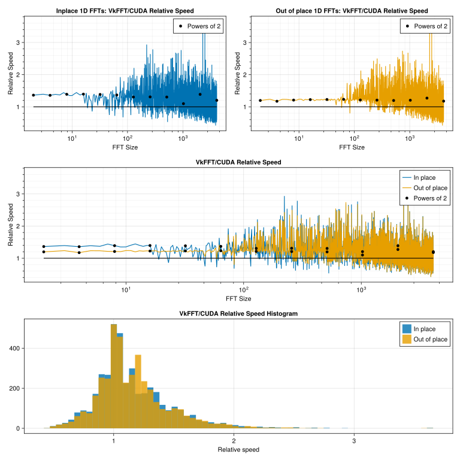

# VkFFTCUDA.jl
Julia bindings for [VkFFT](https://github.com/DTolm/VkFFT).

⚠️ WARNING: These bindings are very barebones and do not fully implement all the functionality exposed by VkFFT. These bindings only expose multidimensional C2C FFTs so far.

## Installation
```julia
using Pkg
Pkg.add("VkFFTCUDA")
Pkg.build("VkFFTCUDA")
```
For now, note that you must build VkFFTCUDA. You will also need to install [the CUDA toolkit](https://developer.nvidia.com/cuda-downloads).

## Purpose
This package allows you to do FFTs on CuArrays using [VkFFT](https://github.com/DTolm/VkFFT) instead of cuFFT. This can result in significant speed-ups:


## Example
```julia
using CUDA, AbstractFFTs, VkFFTCUDA

x = CuArray(ComplexF32.(collect(reshape(1:60, 3, 4, 5))))
ifft(fft(x)) ≈ x # Should return true
```
⚠️ It is very important that you load VkFFTCUDA **after** CUDA because VkFFTCUDA.jl overwrites some methods provided by CUDA.jl

## Documentation
For further documentation, refer to the documentation for [AbstractFFTs.jl](https://juliamath.github.io/AbstractFFTs.jl/stable/api/) as VkFFTCUDA.jl uses this API.

## Known issues
For arrays with more than 4 dimensions, doing FFTs on more than one of the axes will lead to erroneous results. This is not a problem with VkFFT, but rather with the bindings that will be fixed soon™.
